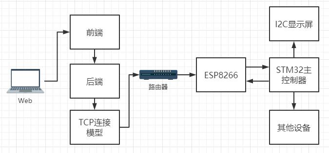
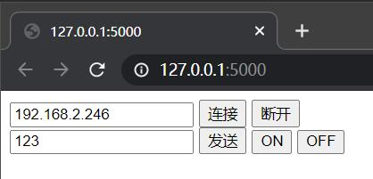
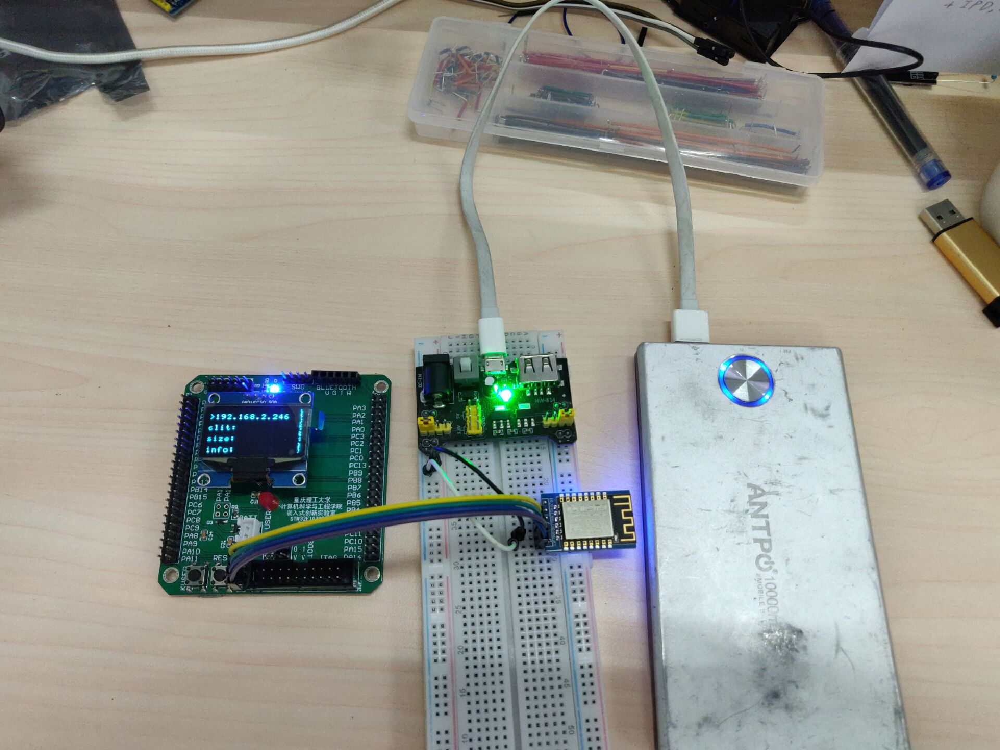

# Flask-stm32-dataTrans
利用ESP8266模块实现python服务端与stm32客户端的数据传输。

本项目包含两个项目：
- flaskProject
- stm32Project
## 一、整体方案
本项目使用ESP8266-WIFI模块接入局域网，利用C/S模型完成需求。

具体思路为控制者与被控者处于同一网络内（实验环境为实验室内网）

利用ESP8266模块建立TCP服务端，Python中的socket包构建TCP客户端

当服务端建立完毕后，客户端便可以通过IP地址完成连接

用户通过Flask编写的web界面，向被控对象发送指令，STM32控制器接收到指令后便可以完成一系列操作



## 二、基本步骤
- 初始化主控制器
    - stm32底层初始化
    - I2C显示屏初始化
    - 配置ESP8266模块
- 初始化ESP8266模块
    - 启动STA模式
    - 连接WIFI
    - 查询本地IP
    - 设置多连接
    - 建立TCP服务器
- 初始化TCP客户端
    - 设置IP地址与端口
    - 创建socket对象
    - 建立socket连接
- 初始化Flask服务器
    - 前端界面
    - 后端API
- 客户端向ESP8266发送信息
    - 前端按钮通过AJAX方式向后端发起请求
    - 后端调用TCP客户端向ESP8266发送消息
- 主控制器接收信息
    - 与ESP8266通过串口连接的主控制器进入串口中断回调
    - 根据指令打开或关闭相关外设
## 三、stm32对esp8266进行初始化
- 首先stm32要实现串口不定长数据的接收（在stm32driver项目中有详细概述）
- 其次利用状态转移对esp8266进行初始化
- 初始化完成后的一些基本信息可以显示在I2C屏幕上（例如esp被分配的IP地址，后续flask页面需要连接这个IP地址）
```c
void user_API(uint8_t temp[], uint8_t temp_len){
  if(flag<6){
    OLED_flash(temp, temp_len);
  }
  if(flag == 0){
    str_pos = GetSubStrPos(temp, "WIFI GOT IP");
    if(str_pos != -1){
      DMA_Usart1_Send("AT+CIFSR\r\n", 10);
      flag=1;
    }
  } else if(flag == 1){
    str_pos = GetSubStrPos(temp, "+CIFSR:STAIP,");
    if(str_pos != -1){
      for(uint8_t i=0; i<13; i++){
        ipaddr[i+1] = temp[str_pos+14+i];
      }
      OLED_ShowString_cnt(1,1,ipaddr,8, 14);

      DMA_Usart1_Send("AT+CIPMUX=1\r\n", 13);
      flag=2;
    }
  } else if(flag == 2){
    str_pos = GetSubStrPos(temp, "OK");
    if(str_pos!=-1){
      DMA_Usart1_Send("AT+CIPSERVER=1\r\n", 16);
      flag=3;
    }
  } else if(flag == 3){
    str_pos = GetSubStrPos(temp, "OK");
    if(str_pos!=-1){
      DMA_Usart1_Send("AT+CIPSTO=0\r\n", 13);
      flag=4;
    }
  } else if(flag == 4){
    str_pos = GetSubStrPos(temp, "OK");
    if(str_pos!=-1){
      DMA_Usart1_Send("AT\r\n", 4);
      flag=5;
    }
  } else if(flag == 5){
    str_pos = GetSubStrPos(temp, "OK");
    if(str_pos!=-1){
      OLED_Clear();
      OLED_ShowString_cnt(1,1,ipaddr,8, 14);
      OLED_formatFlash();
      flag = 6;
    }
  } else if(flag == 6){
    str_pos = GetSubStrPos(temp, "+IPD");
    if(str_pos!=-1){
      uint8_t p1[] = "0";
      uint8_t p2[] = "3";
      uint8_t p3[10];
      p1[0] = temp[str_pos+5];
      p2[0] = temp[str_pos+7];
      uint8_t p3_len = (uint8_t)(p2[0]-'0');
      for(uint8_t i=0; i<p3_len; i++){
        p3[i] = temp[str_pos+9+i];
      }

      OLED_infoFlash(p1, p2, p3, p3_len);
    }
  }
  //  DMA_Usart1_Send(rx1_buffer, rx1_len);
}
```
## 四、调试esp8266时可能需要用到的AT指令
```text
AT  # AT测试
AT+CWMODE=1  # STA模式
AT+CWJAP="ssid","password"  # 连接WIFI
AT+CIFSR  # 查询本地IP
AT+CIPMUX=1 # 设置多连接
AT+CIPSERVER=1  # 建立TCP服务器
```
## 五、完成效果
### 1、Web界面

### 2、被控端
从左往右依次为：
- STM32开发板、I2C显示屏
- 供电模块、ESP8266模块
- 电源

### 3、演示
`在./README目录下`